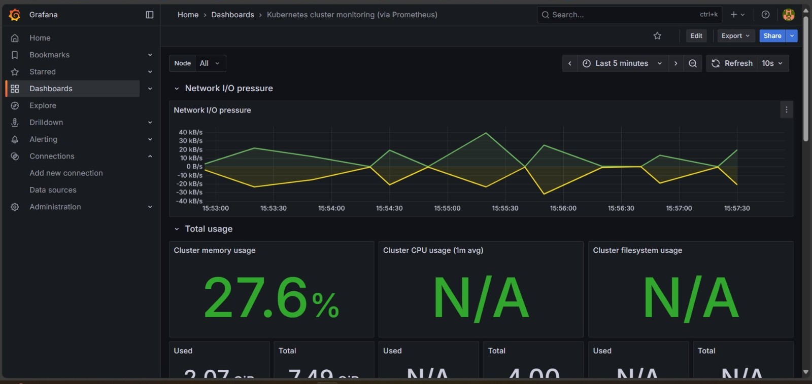
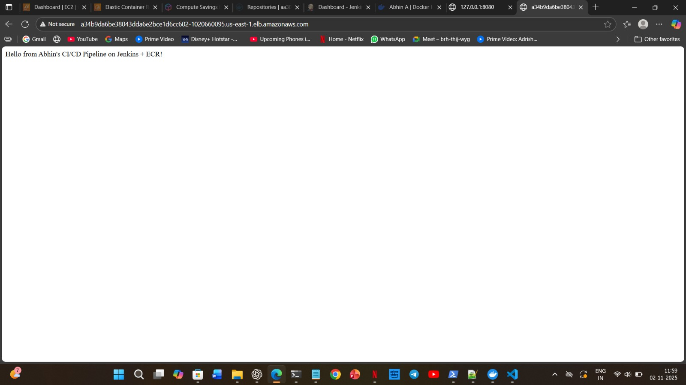

## 🚀 End-to-End DevOps CI/CD Pipeline (Jenkins + Docker + ECR + EKS + ArgoCD + Grafana)

### 📘 Overview
This project demonstrates a **complete CI/CD GitOps pipeline** for a sample Python web application.
It uses **Jenkins** for continuous integration, **ArgoCD** for continuous deployment, and **Prometheus + Grafana** for monitoring — deployed on an **AWS EKS Kubernetes cluster**.

---

## 🧱 Architecture

GitHub → Jenkins → Docker → ECR → Kubernetes (EKS) → ArgoCD → Prometheus → Grafana


Each stage of the pipeline is automated and observable.

| Stage | Tool | Description |
|--------|------|-------------|
| **Source Code Management** | GitHub | Code + pipeline stored in repository |
| **Build & CI** | Jenkins | Builds Docker image and pushes to ECR |
| **Image Repository** | AWS ECR | Stores versioned Docker images |
| **Container Orchestration** | Kubernetes (EKS) | Runs application workloads |
| **Deployment Automation** | ArgoCD | Automates GitOps deployment from Helm |
| **Monitoring** | Prometheus + Grafana | Collects and visualizes metrics |

---

## 🧰 Tech Stack
- **Language:** Python (Flask)
- **CI/CD Tools:** Jenkins, GitHub Actions (optional)
- **Containerization:** Docker, AWS ECR
- **Orchestration:** Kubernetes (EKS)
- **Deployment:** Helm, ArgoCD
- **Monitoring:** Prometheus, Grafana

---

## 🧩 Folder Structure
```bash
myapp-ecr-pipeline/
│
├── app.py                     # Sample Python web app
├── requirements.txt            # Flask dependencies
├── Dockerfile                  # Container build file
├── Jenkinsfile                 # CI/CD pipeline definition
│
├── helm/myapp/                 # Helm chart for Kubernetes deployment
│   ├── Chart.yaml
│   ├── values.yaml
│   └── templates/
│       ├── deployment.yaml
│       └── service.yaml
│
├── argocd/                     # ArgoCD GitOps application manifest
│   └── myapp-argo-application.yaml
│
├── monitoring/                 # Prometheus & Grafana configurations
│   ├── prometheus-configmap.yaml
│   └── grafana-dashboard-ids.txt
│
└── screenshots/                # Visual proofs
    ├── argo-dashboard.png
    ├── grafana-dashboard.png
    ├── kubectl-get-pods.png
    ├── hello-webpage.png
    └── jenkins-pipeline-success.png
```

⚙️ CI/CD Workflow Summary

1️⃣ Jenkins (CI)

Triggers automatically when code is pushed to GitHub.

Builds a Docker image from Dockerfile.

Pushes image to AWS ECR.

2️⃣ ArgoCD (CD)

Watches this GitHub repo (helm/myapp folder).

Syncs Helm manifests to Kubernetes.

Automatically deploys or updates the application on EKS.

3️⃣ Prometheus + Grafana (Monitoring)

Prometheus scrapes metrics from EKS pods and ArgoCD.

Grafana visualizes cluster and deployment metrics.

Dashboards imported:

🧭 315 — Kubernetes Cluster Monitoring

⚙️ 6417 — Node Exporter Full

📊 14584 — ArgoCD Metrics

🖼️ Screenshots

### 1. ArgoCD Dashboard


### 2. Grafana Monitoring


### 3. Application Page


### 4. Kubernetes Pods


	
Application Output

🔒 AWS Integration

ECR Repository: Stores Docker images securely.

EKS Cluster: Manages scalable deployment.

IAM Roles: Configured for Jenkins & ArgoCD automation.

📈 Results

✅ Fully automated build & deployment pipeline
✅ Continuous GitOps sync from GitHub → Kubernetes
✅ Real-time monitoring with Prometheus & Grafana
✅ End-to-end visibility into build → deploy → observe

🧠 Key Learnings

GitOps workflow simplifies continuous deployment.

Infrastructure as Code (IaC) ensures reproducibility.

Jenkins + ArgoCD together bridge CI and CD beautifully.

Kubernetes monitoring stack (Prometheus + Grafana) completes the DevOps lifecycle.

👨‍💻 Author

Abhin |
DevOps Engineer | Cloud & Automation Enthusiast 
|
 abhin.devops01@gmail.com |
 https://github.com/abhin7821
